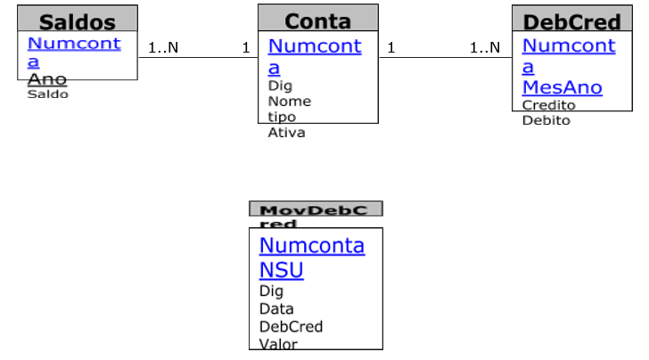

# Projeto da disciplina de Banco de Dados II do Curso Superior de Tecnologia em Sistemas para Internet do IFPB

## Objetivo
O objetivo deste projeto é implementar rotinas automáticas de processamento em banco de dados utilizando ​stored procedures, cursores, triggers, visões e suporte transacional para garantia da atomicidade.

## Banco de Dados
O projeto deve foi implementado no banco de dados PostgreSQL.

## Esquema de Banco de Dados
Considere o seguinte esquema relacional para um sistema de contabilidade:

Cada tabela é definida sucintamente da seguinte maneira:
* **Contas:** armazena informações sobre as contas do sistema, com números exclusivos;
* **Saldos:**  armazena o saldo inicial de cada ano para cada conta;
* **DebCred:**  armazena o total de débito e crédito de cada conta em um determinado mês e ano;
* **MovDebCred:**  ​tabela responsável por toda a movimentação financeira das contas para cada mês e ano, onde cada conta pode receber inúmeras movimentações.